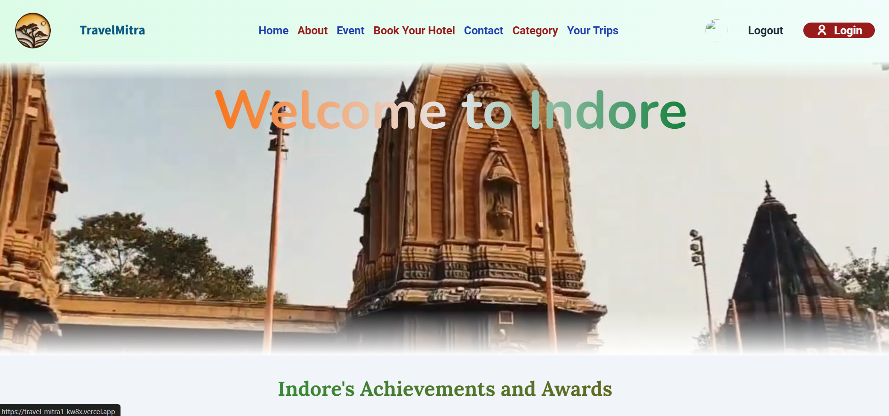
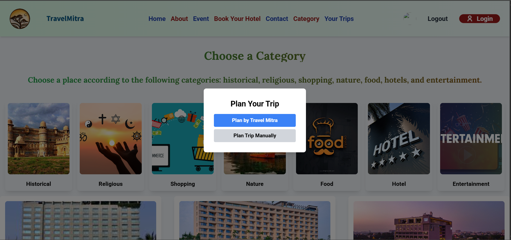
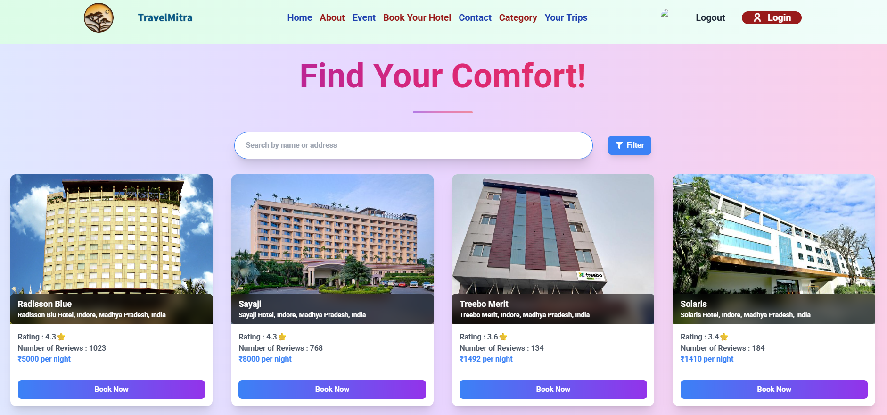
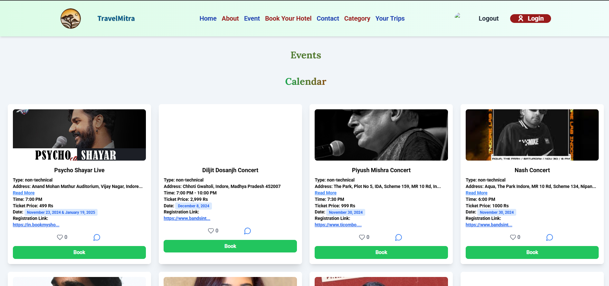
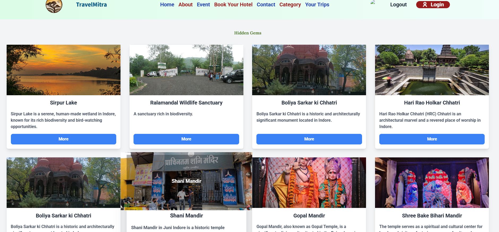
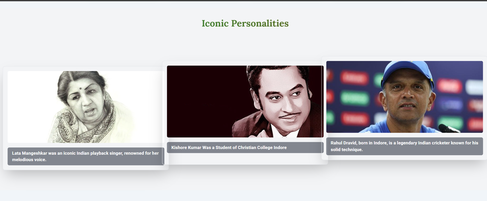

# 🌍✨ **TravelMitra**

**🚀 Live Project:** [TravelMitra](https://travel-mitra1-kw8x.vercel.app/)  
**💻 GitHub Repository:** [GautamSutar/TravelMitra1](https://github.com/GautamSutar/TravelMitra1.git)

---

---

## 🖼️ **Webpages Preview**

### 🏠 **Home Page**
> Welcomes users with a beautiful interface and navigation to explore key sections.  


---

### 🧳 **Category Page**
> Explore attractions under categories like Historical, Religious, Shopping, Nature, and more.  


---

### 🏨 **Hotel Booking Page**
> Search hotels, compare prices, and book your stay easily.  


---

### 🎉 **Events & Festivals**
> Find cultural events and celebrations happening in your chosen city.  


---

### 🎭 **Hidden Gems**
> Explore lesser-known local treasures and experiences.  


---

### 🌟 **Famous Personalities**
> Learn about the renowned personalities associated with the city.  


---

## 🧭 **Overview**

**TravelMitra** is a full-stack **MERN (MongoDB, Express.js, React.js, Node.js)** web application that simplifies travel planning through **personalized recommendations, hotel bookings,** and **cultural insights**.  

Users can explore **hidden gems, iconic personalities, local festivals,** and even plan trips according to their **budget** or with the help of **AI-driven suggestions**.

It offers two ways to plan your trip:
1. ✨ **Plan by TravelMitra** – AI-assisted and automatically generated plans.  
2. ✍️ **Plan by Yourself** – manually create and customize your own trips.

---

## 🏗️ **Project Structure**

```

TRAVELMITRA1/
├── backend/                 # Node.js + Express server
├── travel_and_tourism/      # React frontend
├── .gitignore
├── package-lock.json
├── package.json
└── README.md

````

---

## 🚀 **Features**

- 🏨 **Hotel Booking:** Explore and book hotels directly from the platform.  
- 🎭 **Cultural Events & Festivals:** Find upcoming cultural and traditional festivals.  
- 🌄 **Hidden Gems:** Discover lesser-known places and local attractions.  
- 🧑‍🎤 **Famous Personalities:** Learn about notable figures from the selected city.  
- 💰 **Budget Planner:** Get travel recommendations under your budget.  
- 🗺️ **Trip Planner:** Choose between AI-assisted or manual trip planning.  
- 💬 **AI Chatbot (Gemini API):** Ask queries and get smart travel assistance.  
- 📱 **Responsive Design:** Fully optimized for mobile, tablet, and desktop.  

---

## 🧑‍💻 **Tech Stack**

### 🖥️ **Frontend**
- ⚛️ React.js  
- 🎨 Tailwind CSS  
- ⚡ Vite (Build Tool)

### ⚙️ **Backend**
- 🟢 Node.js  
- 🚀 Express.js  

### 🗄️ **Database**
- 🌐 MongoDB Atlas  
- 💻 MongoDB Compass  

### 🔗 **APIs & Tools**
- 🤖 Gemini API (Chatbot Integration)  
- 🧪 Postman (API Testing)   

---

## 🧩 **System Architecture**

The project architecture follows a classic **three-tier design**:

1. 🎨 **Frontend (React.js)** – Handles all UI/UX and user interactions.  
2. ⚙️ **Backend (Node.js + Express.js)** – Processes requests, authentication, and logic.  
3. 🗃️ **Database (MongoDB Atlas)** – Stores user profiles, destinations, and trip data.  


## ⚙️ **Installation and Setup**

### 🧩 **1️⃣ Clone the repository**
```bash
git clone https://github.com/GautamSutar/TravelMitra1.git
cd TravelMitra1
````

### ⚙️ **2️⃣ Setup the Backend**

```bash
cd backend
npm install
npm start
```

### 💻 **3️⃣ Setup the Frontend**

```bash
cd ../travel_and_tourism
npm install
npm run dev
```

### 🔐 **4️⃣ Add Environment Variables**

Create a `.env` file in the backend directory:

```bash
MONGO_URI=your_mongodb_connection_string
PORT=5000
JWT_SECRET=jwt_screte_key
EMAIL_USER=your_email@gmail.com
EMAIL_PASS=email_password   
ACCESS_TOKEN_SECRET=access_token_secret
REFRESH_TOKEN_SECRET=refresh_token_secret
```

### 🧠 **5️⃣ Run the Application**

Visit:
👉 **[http://localhost:5173/](http://localhost:5173/)**

---

## 📈 **Future Scope**

* 🌐 Expand to include other cities in Madhya Pradesh.
* 🤖 AI-powered smart itinerary suggestions.
* 📱 Mobile app development for Android/iOS.
* 🤝 Local tourism and business collaborations.
* 🧭 Virtual tours and AR experiences.

---

## 🏁 **Conclusion**

**TravelMitra** is your intelligent travel companion — helping users discover cities, book hotels, and plan memorable journeys.
It combines **smart planning, cultural awareness,** and **personalization** to create an all-in-one travel experience.

---

## 🏷️ **License**

This project is open-source and available under the [MIT License](LICENSE).

---

© **2025 TravelMitra** | Built using the **MERN Stack**

```
```
